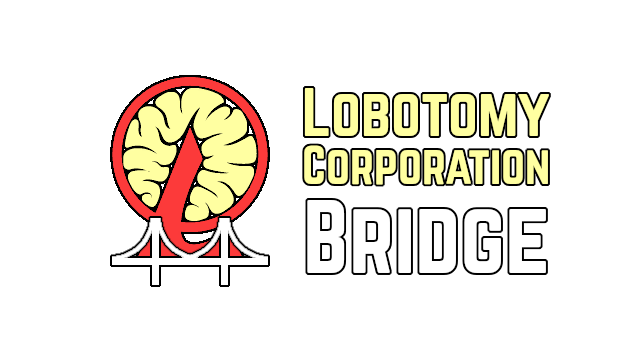

> [!CAUTION]
> This project is still in an early state and most of the game interactions have not been implemented yet. It is not ready for practical use.

# Lobotomy Corp Bridge



[](https://www.npmjs.com/package/lobotomy-corp-bridge)
[](https://github.com/Hawkbat/LobotomyBridgeMod/releases)

A JS client library for the [Lobotomy Corp Bridge game mod](https://github.com/Hawkbat/LobotomyBridgeMod), enabling realtime control and data exchange with the game.

## Installation

You can install the package via npm:

```bash
npm install lobotomy-corp-bridge
```

## Usage

The Lobotomy Corporation game instance must be running, with the [Lobotomy Corp Bridge mod](https://github.com/Hawkbat/LobotomyBridgeMod) installed.

Here is an example of how to use the library:

```typescript
import { Bridge, validateBridgeMessageType } from 'lobotomy-corp-bridge';

const bridge = new Bridge({
    port: 8787,
});

bridge.on('connected', () => {
    console.log('Connected to the game');
});

bridge.on('disconnected', (reconnecting) => {
    if (!reconnecting) {
        console.log('Disconnected from the game');
    }
});

bridge.on('message', async (msg) => {
    console.log('Received message:', msg);
    if (msg.type === 'EnterPrepPhase') {
        const response = await bridge.sendAndWaitForReply('AgentListQuery', { includeActive: true });
        validateBridgeMessageType(response, 'AgentListResponse');
        console.log(response.agents);
    }
});

bridge.connect();
```

You can view a full list of supported `BridgeMessage` types and their fields in [the generated type documentation](https://hawk.bar/lobotomy-corp-bridge/).

### Browser

No additional changes are needed to use this library in client-side browser JS. You will need to target browsers that support ES6 modules if you aren't using a bundler.

### Node and Other Runtimes

When using the library in Node (or other non-browser runtimes that don't provide a browser-compatible WebSocket API in the global scope), you will need to manually provide a WebSocket implementation in the `Bridge` constructor options:

```typescript
import { Bridge, validateBridgeMessageType } from 'lobotomy-corp-bridge';
import { WebSocket } from 'ws';

const bridge = new Bridge({
    webSocketConstructor: WebSocket,
});
```

Additionally, in Node versions older than v15.6.0 or v14.17.0 (or other non-browser runtimes that do not provide a browser-compatible Cryptography API in the global scope), you will need to provide an equivalent to `crypto.randomUUID()`:

```typescript
import { Bridge, validateBridgeMessageType } from 'lobotomy-corp-bridge';
import { randomUUID } from 'node:crypto';

const bridge = new Bridge({
    uuidGenerator: randomUUID,
});
```

## Scripts

- `build`: Compiles the TypeScript code.
- `build:watch`: Compiles the TypeScript code in watch mode.
- `serve`: Serves the project using a local server.

## License

This project is licensed under the MIT License.

## Contributing

If you find any issues or have suggestions for improvements, please open an issue or submit a pull request on [GitHub](https://github.com/Hawkbat/lobotomy-corp-bridge).

## Author

Hawkbar

## Links

- [Homepage](https://github.com/Hawkbat/lobotomy-corp-bridge)
- [Issues](https://github.com/Hawkbat/lobotomy-corp-bridge/issues)
